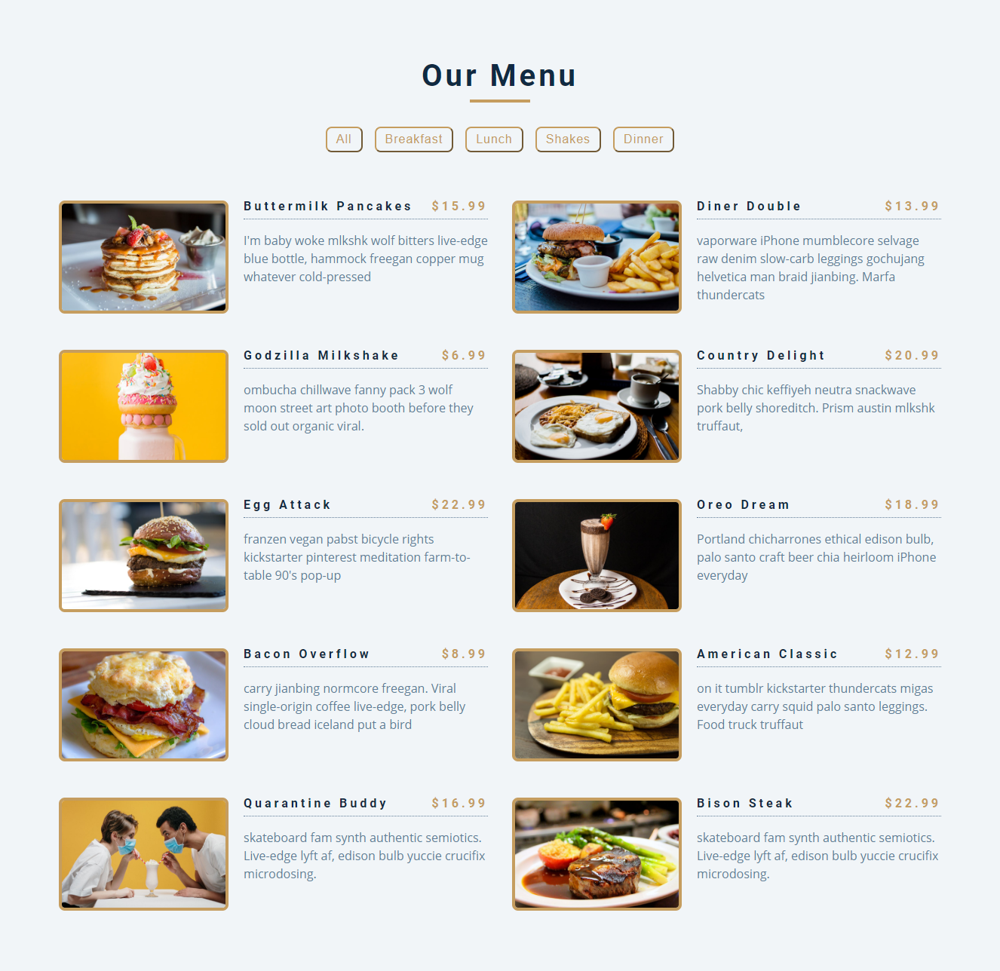
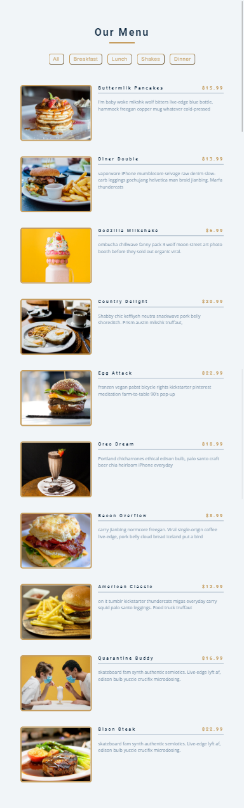
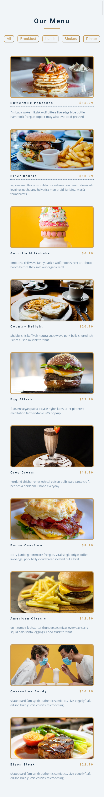

# Menu Challenge 

* Data can be found [here](https://raw.githubusercontent.com/OmarInCS/intro-to-html-css-js-jquery/challenges/challenges/menu/data.json), use jQuery get method to load it dynamically.
* filter the menu and show only related items when button pressed.
###### credit to [FreeCodeCamp](https://www.youtube.com/watch?v=3PHXvlpOkf4&list=PLSW1dSaCa1HzYgtgRmTetqBo3g__pTWsp)

## In Desktop should look like

## In Tablet should look like

## In Mobile should look like

